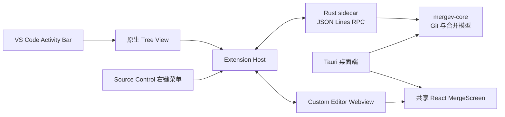

# mergev VS Code 插件技术方案与实施进展

> 文档状态：已确认方案，实施中  
> 最近更新：2026-08-15  
> 当前分支：按仓库工作流管理

## 1. 背景与目标

mergev 目前是基于 Tauri、React 和 Rust 的桌面端 Git 冲突解决工具。
本次工作不是将桌面端替换为 VS Code 插件，而是在完整保留桌面端能力、
入口和发布方式的前提下，增加一个 VS Code 插件入口。

第一版的目标是：用户安装 `.vsix` 后，可以在 VS Code 左侧 Activity Bar 打开 mergev，按需查看当前工作区内各仓库的冲突文件，并在主编辑区域使用与桌面端一致的三栏操作界面完成冲突处理。

核心约束：

- 现有桌面端功能和行为不得退化。
- VS Code 原生 Merge Editor 保留，mergev 作为额外入口并存。
- mergev Tab 是冲突处理操作界面，不是普通文本编辑器。
- 第一版先用于本地安装和内部测试，不发布到 Marketplace。

## 2. 第一版范围

### 2.1 支持范围

- VS Code 1.85 及以上版本。
- 本地 macOS 与 Windows。
- macOS：Apple Silicon（arm64）和 Intel（x64）。
- Windows：x64 和 arm64。
- 单根工作区和 Multi-root Workspace。
- Git merge、rebase、cherry-pick、revert 等桌面端当前可识别的冲突状态。
- 通过 `.vsix` 本地安装。

### 2.2 暂不支持

- Linux。架构需保留扩展能力，后续再增加对应 sidecar。
- Remote SSH、WSL、Dev Container 和其他远程 Extension Host 场景。
- 未完成冲突决策的 Tab 会话恢复。
- Result 手工编辑模式。
- 键盘快捷键和键盘保存。
- Marketplace 发布、自动更新和遥测。

## 3. 已确认的产品表现

### 3.1 Activity Bar 与仓库树

- 安装插件后，Activity Bar 始终显示 mergev 图标。
- 未打开工作区时，视图显示“请先打开项目”，并提供“打开项目”操作。
- 当前工作区没有 Git 仓库时，显示“当前项目没有 Git 仓库”，并提供“打开项目”操作。
- 使用 VS Code 原生 Tree View。
- 层级固定为“仓库 → 冲突文件”，不增加目录层级。
- 只展示 VS Code Workspace Folder 根目录对应的仓库，不扫描任意子仓库。
- 多个仓库按照 Workspace Folder 顺序展示。
- 所有仓库默认折叠；插件激活或视图重新可见时，先主动加载各 Workspace Folder 的仓库快照。
- 用户每次展开仓库时仍立即重新读取状态，确保冲突文件列表反映最新 Git 状态。
- 冲突文件按文件名排序，再按目录排序，与桌面端现有逻辑一致。
- 冲突文件节点展示桌面端已有的文件名、目录、双方状态和冲突块信息。
- 仓库节点加载后展示当前分支、Git 操作类型和仓库状态。
- 仓库无冲突时显示不可点击的“当前没有待解决的冲突”。
- 仓库加载失败时显示不可点击的错误节点，并提供“重试”。
- 不显示 Activity Bar 徽标，避免把“未扫描”误解为“没有冲突”。
- 不提供顶部全局刷新，只在仓库节点悬停时显示该仓库的刷新按钮。
- 工作区根目录发生变化时更新仓库列表并重新加载快照；视图重新打开时也会重新加载。

### 3.2 Tree View 操作

仓库节点提供：

- 刷新仓库。
- 复制路径。
- 复制分支。
- 在终端中打开。

冲突文件节点提供：

- 使用 mergev 打开。
- Accept Yours。
- Accept Theirs。

如果对应 mergev Tab 中存在未应用的决策，执行整文件 Accept 前必须弹出确认框；用户确认后丢弃 Tab 内决策并执行整文件 Accept。

VS Code Source Control 的冲突文件右键菜单中同时提供“使用 mergev 打开”。
该入口只增加能力，不替换或隐藏 VS Code 原生 Merge Editor。

### 3.3 mergev Tab

- 技术上使用 VS Code Custom Editor API。
- Tab 标题格式为 `mergev: project-a / src/user.ts`。
- 同一仓库、同一文件只打开一个稳定 URI；重复点击时聚焦已有 Tab。
- 不同冲突文件可以同时保留多个 mergev Tab，并像普通 Tab 一样切换和关闭。
- 主区域复用桌面端当前三栏 MergeScreen，仓库和文件导航由左侧 Tree View 负责。
- 三栏固定为 Yours、Result、Theirs，Result 始终只读。
- 只有所有冲突块都处理完成后，“应用”按钮才可用。
- 第一版不提供“编辑结果”。
- 不注册 VS Code 全局快捷键；三栏 Webview 内支持桌面端的撤销与恢复快捷键。
- 禁止 `Cmd+S` / `Ctrl+S` 保存，只允许点击 mergev 的“应用”按钮。
- 点击“应用”后写回文件并执行 `git add`。
- 应用成功后，文件从仓库冲突列表中移除，但当前 Tab 保留，供用户检查结果。
- 文件在外部解决后，Tab 保留并显示“文件已在外部解决”，提供“重新加载结果”。
- 用户主动刷新仓库时，属于该仓库的所有 mergev Tab 自动重新加载；无论是否存在未应用决策，都直接丢弃当前 Tab 状态，不再确认。
- 第一版关闭 Tab 后不恢复未完成的决策，后续版本再增加会话恢复。
- 插件文案沿用桌面端当前用语，不单独建立另一套术语。

## 4. 技术架构

采用已确认的方案 B：Rust sidecar + VS Code Extension Host。



### 4.1 Extension Host

职责：

- 注册 Activity Bar、Tree View、命令、菜单和 Custom Editor。
- 按 Workspace Folder 顺序维护仓库节点。
- 只在展开或单仓库刷新时请求仓库状态。
- 管理稳定文档 URI，避免重复 Tab。
- 管理打开的 Webview、未应用决策标记和仓库刷新联动。
- 根据 `process.platform`、`process.arch` 选择 sidecar。
- 在 Git、sidecar 或平台不可用时显示明确错误。

Extension Host 不自行实现 Git 冲突解析，不复制 Rust 核心算法。

### 4.2 Rust sidecar

sidecar 是本地长驻子进程，通过 stdin/stdout 使用一行一个 JSON 的 RPC 协议。当前接口包括：

| 方法 | 用途 |
| --- | --- |
| `ping` | 检查 sidecar 版本与可用性 |
| `getRepositoryWorkspace` | 读取分支、操作类型和冲突文件 |
| `getMergeDocument` | 读取三栏合并文档 |
| `getConflictCount` | 读取单文件冲突块数量 |
| `saveMergeResult` | 写回 Result，并按参数执行 `git add` |
| `acceptFileSide` | 整文件 Accept Yours / Theirs 并暂存 |

协议要求：

- 每个请求包含唯一 `id`、`method` 和 `params`。
- 每个响应包含相同 `id`、`ok`，以及 `result` 或 `error`。
- stdout 只能输出协议数据，诊断日志写 stderr。
- Extension Host 退出时关闭 sidecar，并拒绝所有未完成请求。

### 4.3 共享 Rust 核心

桌面端和 sidecar 共用 `mergev-core`，统一负责：

- Git 仓库状态与操作类型识别。
- 冲突文件列表、双方状态和冲突块计数。
- 三方内容读取和 MergeDocument 构建。
- Result 校验、文件写回和暂存。
- 整文件 Accept Yours / Theirs。

桌面端仍保留原有 Tauri command 边界，只把内部实现指向共享核心。共享核心改动必须同时通过桌面端和 sidecar 测试。

### 4.4 共享 React 三栏界面

桌面端和 VS Code Webview 复用同一个 `MergeScreen`、`MergeGrid`、冲突决策模型和 Result 序列化逻辑。

宿主差异通过运行时适配器隔离：

- 桌面端适配器调用 Tauri `invoke`、Tauri 确认框和主题事件。
- VS Code 适配器通过 `postMessage` 请求 Extension Host 保存或弹出原生确认框。
- VS Code 适配器仅开启撤销与恢复快捷键，并继续拦截键盘保存及其他桌面端快捷键。
- 两个宿主不分别维护冲突块算法和 Result 拼接逻辑。

### 4.5 Git 与路径处理

- 默认从 `PATH` 调用 Git。
- `mergev.gitPath` 可配置 Git 可执行文件路径，并通过 `MERGEV_GIT_PATH` 传给 sidecar 和共享核心。
- Git 不可用时提示用户安装 Git 或配置 Git 路径。
- 所有文件操作只接受仓库内相对路径，拒绝绝对路径和 `..` 路径穿越。
- 第一版只允许运行于本地 macOS 和 Windows；远程和其他平台返回明确错误，不静默失败。

## 5. 性能与状态策略

- 插件启动会扫描当前 Workspace Folder 对应的仓库快照，用于立即显示分支和操作状态。
- Tree View 获取根节点时只读取 Workspace Folder 元数据；冲突文件列表在展开仓库时实时读取。
- 仓库展开时执行一次实时扫描；再次展开重新扫描。
- 不监听整个工作区的文件变化或 Git 状态变化。
- 不计算全局冲突数量，也不显示徽标。
- 仅为已经打开的 mergev Tab 保留少量会话状态。
- 关闭 Tab 时立即释放 Webview 和内存状态。
- 仓库刷新只重载该仓库的 Tree 节点和已打开 Tab。

## 6. 桌面端不回归策略

每次共享层改动都必须满足以下条件：

- 桌面端入口、命令行入口、Tauri command 名称和参数保持兼容。
- 桌面端三栏布局、操作按钮、确认文案、主题和快捷键保持现状。
- VS Code 专属代码放在 `apps/vscode/`，不得让桌面端依赖 `vscode` 包。
- 共享核心只能下沉纯 Git/合并能力，不包含 Tauri 或 VS Code 类型。
- 共享 React 组件通过可选宿主适配器扩展，桌面端默认适配器行为不变。
- 合并前必须完成桌面端前端测试、前端生产构建和 Rust 测试。

## 7. 构建与打包

当前目录结构：

```text
apps/desktop/                       Tauri 桌面端宿主与专属界面
apps/vscode/
  src/extension.ts                  Extension Host
  src/webview.tsx                   VS Code Webview 入口
  sidecar/                          Rust sidecar
  bin/darwin-arm64/                 Apple Silicon 二进制
  bin/darwin-x64/                   Intel 二进制
  bin/win32-x64/                    Windows x64 二进制
  bin/win32-arm64/                  Windows arm64 二进制
  media/                            图标与 Webview 构建产物
  package.json                      VS Code 扩展清单
packages/merge-ui/                  跨宿主复用的 React 合并界面与纯前端逻辑
crates/mergev-core/                 共享 Rust 核心
```

打包流程：

1. 分别为 macOS（arm64 / x64）和 Windows（x64 / arm64）构建 release sidecar。
   非 Windows 主机交叉编译 Windows sidecar 时使用 `cargo xwin`。
2. 构建 Extension Host。
3. 构建共享 React Webview、CSS 和受控的语法高亮资源。
4. 将四个架构的 sidecar、扩展代码、媒体和清单写入 VSIX。
5. 检查 VSIX 文件清单，确保不包含 `target/`、测试缓存、旧构建文件和源映射等非必要内容。
6. 在 Intel Mac、Apple Silicon 和 Windows 上分别安装并进行冒烟测试。

## 8. 测试与验收

### 8.1 自动化回归

- `npm run test --workspace @mergev/merge-ui`：共享前端单元测试。
- `npm run build --workspace mergev-desktop`：桌面端 TypeScript 和生产构建。
- `cargo test --offline --manifest-path crates/mergev-core/Cargo.toml`：共享核心测试。
- `cargo test --offline --manifest-path apps/desktop/src-tauri/Cargo.toml`：桌面端 Rust 回归。
- sidecar 编译检查：
  `cargo check --offline --manifest-path apps/vscode/sidecar/Cargo.toml`。
- Extension Host TypeScript 类型检查和生产构建。
- Webview 构建及生成资源引用检查。

### 8.2 Git 冲突 fixture

至少覆盖：

- 普通双方修改。
- 多个冲突块。
- 空行和文件末尾换行。
- modify/modify。
- modify/delete。
- delete/modify。
- 双方内容按左→右、右→左组合。
- Accept Yours / Accept Theirs 后文件内容和暂存状态。
- Result 含冲突标记时拒绝保存。
- 文件路径穿越和 Git 不可用错误。

### 8.3 VS Code 手工验收

- Activity Bar 图标始终可见。
- 未打开项目、非 Git 项目、无冲突和加载失败状态正确。
- 多仓库顺序、默认折叠和按需扫描正确。
- 重新展开不使用缓存。
- 单仓库刷新不会扫描其他仓库。
- 文件排序、展示信息和上下文菜单正确。
- Source Control 冲突文件入口正确，原生 Merge Editor 仍可用。
- 同一文件复用 Tab，不同文件可保留多个 Tab。
- 三栏界面与桌面端一致，Result 不可编辑。
- 未全部处理时“应用”不可用。
- `Cmd+Z` / `Ctrl+Z` 可撤销冲突决策，`Cmd+Shift+Z` / `Ctrl+Shift+Z` 可恢复冲突决策。
- `Cmd+S` / `Ctrl+S` 不保存。
- 应用后文件写回、暂存、Tree 移除且 Tab 保留。
- 整文件 Accept 的未保存决策确认正确。
- 仓库刷新自动重载对应 Tab 并丢弃未应用决策。
- 外部解决后的 Tab 状态和重新加载行为正确。

## 9. 分阶段执行计划

### 阶段 A：建立桌面端基线

- 固定当前桌面端测试结果和关键行为。
- 记录三栏文案、文件排序、Accept 行为和保存语义。
- 验收门槛：未引入 VS Code 代码前，桌面端测试全部通过。

### 阶段 B：共享 Rust 核心

- 建立 `mergev-core`。
- 让 Tauri 和 sidecar 调用相同 Git/合并实现。
- 保持 Tauri command 对前端的接口不变。
- 验收门槛：共享核心和桌面端 Rust 测试通过。

### 阶段 C：Extension Host 与 Tree View

- 注册 Activity Bar、Tree View、命令和菜单。
- 实现多仓库、按需扫描、单仓库刷新、错误和空状态。
- 实现 Source Control 入口与稳定 mergev URI。
- 验收门槛：不展开仓库时不得启动扫描；所有 Tree 状态可手工验证。

### 阶段 D：共享 MergeScreen Custom Editor

- 抽象宿主保存、确认、主题和脏状态接口。
- 在 Webview 中加载共享 React 三栏界面。
- 实现 Tab 去重、只读 Result、应用门槛和禁用保存快捷键。
- 验收门槛：桌面端和 VS Code 使用同一冲突决策与序列化代码。

### 阶段 E：多架构打包

- 构建 macOS arm64 / x64 与 Windows x64 / arm64 sidecar。
- 清理 Webview 多余资源和旧产物。
- 生成包含上述架构二进制的最新 VSIX。
- 验收门槛：Mac 与 Windows 均可安装、启动和完成一次真实冲突处理。

### 阶段 F：内部测试与发布准备

- 使用真实冲突 fixture 完成端到端测试。
- 修复 UI、路径、Git 状态和打包问题。
- 补充安装、配置、已知限制和问题反馈说明。
- 第一版仅交付内部 VSIX；Marketplace 发布另立计划。

## 10. 当前实施进展

以下进展基于 2026-08-15 当前工作区，代码尚未提交。

| 模块 | 状态 | 说明 |
| --- | --- | --- |
| 仓库结构 | 已完成 | 桌面端、插件、共享 UI 与共享 Rust 核心已按 monorepo 目录隔离 |
| 桌面端隔离 | 自动化回归已完成 | Tauri command 边界保留，共享 UI 已移除对 Tauri 的静态依赖并改由宿主 runtime 注入 |
| `mergev-core` | 已实现 | 已建立共享 crate，Tauri 已改为通过共享 crate 调用原 workspace 实现 |
| Rust sidecar | 已实现 | RPC、Git 路径配置、保存、暂存和含删除场景的整文件 Accept 已完成 |
| 路径保护 | 已实现 | 共享核心统一拒绝绝对路径和父目录穿越 |
| Tree View | 已实现，待实机验证 | Activity Bar、多仓库、默认折叠、展开扫描、空状态、错误重试和仓库菜单已编码 |
| Source Control 入口 | 已修正，待实机验证 | 已使用 VS Code Git merge 资源组条件 |
| Custom Editor Tab | 已实现，待实机验证 | 稳定 URI、Tab 标题、重复聚焦和多文件 Tab 已编码 |
| 共享 MergeScreen | 已实现，待实机验证 | Webview 与桌面端共用 MergeScreen，宿主保存、确认、主题和快捷键行为已隔离 |
| Result 只读与应用门槛 | 已实现 | 复用桌面端决策模型，第一版不提供编辑结果 |
| Tab 脏状态与刷新 | 已实现，待实机验证 | 单仓库刷新会重载相关 Tab 并丢弃当前决策 |
| Apple Silicon sidecar | 已生成 | `bin/darwin-arm64/mergev-sidecar` 已存在 |
| Intel sidecar | 已生成 | `bin/darwin-x64/mergev-sidecar` 已生成并确认是 x86_64 Mach-O |
| Windows x64 sidecar | 已接入 | `bin/win32-x64/mergev-sidecar.exe` 由 `cargo xwin` 交叉编译 |
| Windows arm64 sidecar | 已接入 | `bin/win32-arm64/mergev-sidecar.exe` 由 `cargo xwin` 交叉编译 |
| VSIX | 已重新生成，待实机验收 | 最新 VSIX 包含共享 UI、精简资源和 macOS / Windows sidecar |
| Git 冲突 fixture | 已完成 | 已覆盖双方修改、Result 保存暂存、整文件 Accept 和双方删除场景 |
| 自动化测试 | 已通过 | 80 个前端测试、26 个核心测试及全部构建检查通过 |
| VS Code 实机测试 | 进行中 | VSIX 已在 arm64 VS Code 注册，UI 和真实 Git 流程待验收 |

## 11. 当前已知问题与下一步

按优先级继续处理：

1. 在 Apple Silicon VS Code 中完成端到端手工验收，重点验证
   Source Control 菜单上下文、Tree 刷新和 Tab 生命周期。
2. 在 Intel Mac 上安装同一 VSIX，验证 x86_64 sidecar 可启动并完成一次
   真实冲突处理。
3. 在 Windows（x64 或 arm64）上安装同一 VSIX，验证 sidecar 可启动并完成一次
   真实冲突处理。
4. 检查完整 diff，确认没有无关格式变化，再提交代码。

## 12. 完成定义

只有同时满足以下条件，第一版 VS Code 支持才算完成：

- 桌面端全部自动化测试和关键手工流程无回归。
- Apple Silicon、Intel 与 Windows sidecar 均包含在 VSIX 中。
- VSIX 可在本地 Mac 和 Windows 上安装并正常启动。
- 多仓库按需加载策略符合本文约定，无全局预扫描和徽标。
- Tree View、Source Control 入口和 Custom Editor 主流程全部通过验收。
- 三栏操作界面复用桌面端实现，Result 始终只读。
- 应用和整文件 Accept 的最终文件内容、Git 暂存状态正确。
- 已知限制在 README 中明确说明。
- 当前旧 VSIX 被最新验证通过的内部测试包替换。
